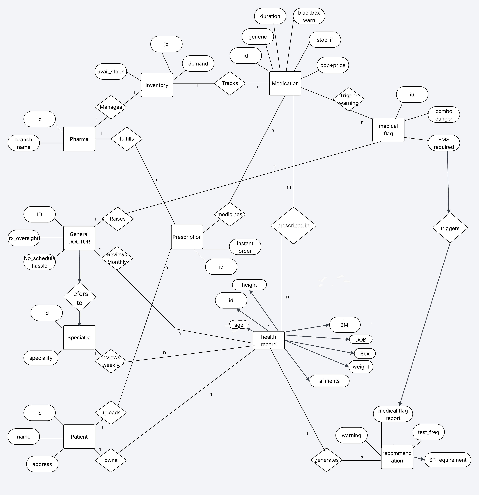

cat << 'EOF' > ER_Architecture.md
# 🏗️ Unified Health Manager: Database Architecture & ER Diagram

 
*(Note: Conceptual Database Blueprint)*

---

## 1. Database Architecture Documentation

### Entities & Attributes
| Entity | Type | Description | Attributes |
| :--- | :--- | :--- | :--- |
| **Patient** | Core | The user receiving care. | id (PK), name, address, cloud_access |
| **General DOCTOR** | Core | Primary care physician. | ID (PK), rx_oversight, no_schedule_hassle |
| **Specialist** | Core | Secondary care physician. | id (PK), speciality |
| **Pharma** | Core | Pharmacy branch/pharmacist. | id (PK), branch_name |
| **Health Record** | Data | Central patient profile. | id (PK), age (derived), DOB, Sex, weight, height, BMI, ailments |
| **Medication** | Data | Master drug catalog. | id (PK), generic, duration, blackbox_warn, stop_if, pop_price |
| **Prescription** | Transaction | Doctor's drug order. | id (PK), instant_order |
| **Inventory** | Tracker | Pharmacy stock levels. | id (PK), avail_stock, demand |
| **Medical Flag** | Alert | CDSS system warnings. | id (PK), combo_danger, ems_required |
| **Recommendation** | Output | Automated/Manual advice. | id (PK), warning, test_freq, sp_requirement |

### Key Relationships & Cardinalities
| Entity A (Origin) | Relationship | Entity B (Target) | Cardinality | Business Logic Implication |
| :--- | :--- | :--- | :--- | :--- |
| Patient | **owns** | Health Record | 1 : 1 | A patient has one lifetime master record. |
| Patient | **uploads** | Health Record | 1 : N | Patient can log multiple updates/data points over time. |
| General DOCTOR | **Reviews** | Health Record | 1 : N | GPs manage multiple patient profiles. |
| General DOCTOR | **Raises** | Medical Flag | 1 : N | Doctors can manually trigger severe system alerts. |
| General DOCTOR | **refers to** | Specialist | M : N | GPs send complex cases to specialists. |
| Health Record | **prescribed in** | Medication | M : N | The active medication log for a specific patient. |
| Health Record | **generates** | Recommendation | 1 : N | CDSS analyzes the record to output advice. |
| Medication | **Trigger warning** | Medical Flag | 1 : N | Specific drugs/combos automatically set off alerts. |
| Pharma | **fulfills** | Prescription | 1 : N | Pharmacies clear multiple prescription orders. |

---

# 🏥 Unified Health Manager: CDSS Architecture MVP


*(Conceptual Database Blueprint)*

## 📖 Executive Summary
The **Unified Health Manager** is a conceptual database architecture and web application designed to bridge the gap between patient history, active prescriptions, and pharmaceutical safety. 

Built as a rapid 1-week Minimum Viable Product (MVP), this phase prioritizes backend architecture over frontend UI. The primary objective is to demonstrate a robust **Clinical Decision Support System (CDSS)**—a relational database structure capable of tracking active patient medications and automatically detecting dangerous drug interactions (e.g., severe renal failure risks) using predefined clinical rules.

---

## ✨ Core Features (MVP Scope)
* **Strict Patient Profiling (1:1):** Enforces a single, lifetime master health record per user to prevent duplicate or conflicting medical histories.
* **Active Medication Tracking (M:N):** Utilizes junction tables to log exactly which commercial drug brands a patient is currently taking.
* **Hierarchical Drug Catalog:** Separates generic chemical compositions from commercial brands, allowing the system to run safety checks on the chemical level.
* **CDSS Conflict Engine:** A self-referencing bridge table that maps dangerous generic-to-generic interactions.
* **Automated Data Pipeline:** Real-world pharmaceutical data and clinical warnings populated via a custom Python ETL scraper, rather than dummy text.

---

## 🛠️ Technology Stack
* **Frontend:** HTML5, CSS3 (Vanilla)
* **Backend:** PHP 8+ (PDO for secure database interactions)
* **Database:** MySQL (Relational Architecture)
* **Data Pipeline (ETL):** Python 3 (Requests, BeautifulSoup, Regex)

---

## 📂 Repository Structure

| File | Type | Description |
| :--- | :--- | :--- |
| `master_setup.sql` | Database | The master SQL script to build the entire schema from scratch, including tables, relationships, and CDSS seed data. |
| `user_dashboard.php` | Frontend/Backend | The Patient Portal. Simulates a logged-in patient, allowing them to initialize their master record and log active medications. |
| `inventory.php` | Frontend/Backend | The Pharmacy View. A read-only dashboard executing `JOIN` queries to display commercial brand data alongside scraped clinical warnings. |
| `medex_scraper.py` | ETL Script | Python script that scrapes a live pharmaceutical database, parses clinical warnings using Regex, and formats them into SQL. |
| `er_final.png` | Asset | The Entity-Relationship diagram visualizing the architecture. |

---

## ⚙️ Installation & Setup
To run this project locally or on a standard LAMP/XAMPP stack:

**1. Database Initialization:**
* Open phpMyAdmin or your MySQL client.
* Create a new database (e.g., `bracculs_hrec`).
* Import and run the `master_setup.sql` script to build the tables and inject the 16 base medications and conflict rules.

**2. Application Configuration:**
* Place `user_dashboard.php` and `inventory.php` in your server's public root directory (e.g., `htdocs` or `public_html`).
* Update the database credentials at the top of both PHP files to match your local/server environment:
  ```php
  $host = 'localhost'; 
  $db   = 'bracculs_hrec'; 
  $user = 'your_db_username'; 
  $pass = 'your_db_password';
echo "✅ Updated ER_Architecture.md with Implementation Scope!"
