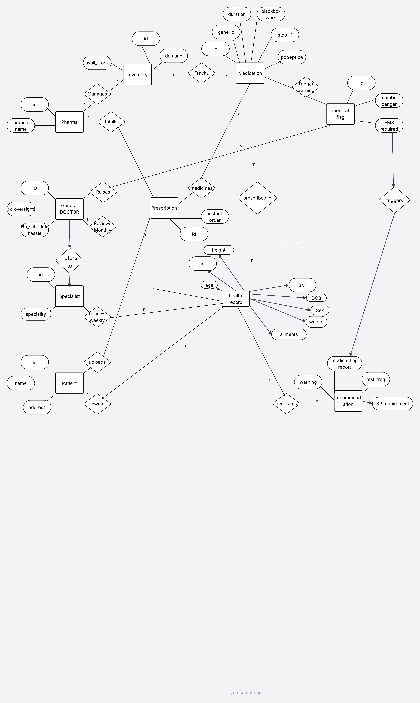

# 🏗️ Unified Health Manager: Database Architecture & ER Diagram

 
*(Note: Save your ER diagram image as `diagram_placeholder.png` in the same folder to display it here).*

---

## 1. The Core Users (Entities and Attributes)
These are the people and organizations interacting with the system.

* **Patient:** Represents the user of the system.
  * *Attributes:* ID (unique identifier), Name, Address, Cloud Access (personalized cloud-based account).
* **General DOCTOR:** Represents the General Practitioner overseeing care.
  * *Attributes:* ID, RX Oversight status, No Schedule Hassle (asynchronous review capability).
* **Specialist:** Represents specialized doctors handling tougher cases.
  * *Attributes:* ID, Speciality.
* **Pharma:** Represents the pharmacy or pharmacists.
  * *Attributes:* ID, Branch Name.

## 2. Health Data and Tracking (Entities and Attributes)
These tables store the medical information and automated Clinical Decision Support System (CDSS) warnings.

* **Health Record:** The central 1:1 repository for a patient's health data.
  * *Flattened Attributes:* ID, Anony_ID (for secure review), Online Report, Height, Weight, BMI, Age, DOB, Sex, Ailments.
* **Medical Flag:** Serious alerts raised by the system's CDSS logic.
  * *Attributes:* ID, Combo Danger (dangerous drug interactions), EMS Required (emergencies).
* **Recommendation:** Actionable advice generated by the system.
  * *Attributes:* ID, Warning (dietary/lifestyle), Test Freq (recommended testing frequency), SP Requirement (specialist needed).

## 3. Medication and Pharmacy Operations (Entities and Attributes)
These tables handle the catalog, supply, and tracking of drugs.

* **Medication:** The master catalog of available drugs (The `Generics` and `Brands`).
  * *Attributes:* ID, Generic Type, Typical Duration, Blackbox Warn (boolean flag for severe effects), Stop_If condition, Pop+Price score.
* **Prescription:** The actual order for medicine.
  * *Attributes:* ID, Instant Order status.
* **Inventory:** Tracks what the pharmacy actually has on shelves.
  * *Attributes:* ID, Avail_Stock, Demand, Dropship option.

## 4. How Everything Connects (The Relationships)

**Patient & Core Records:**
* A **Patient** (1) *owns* a **Health Record** (1). (Strict 1:1 Lifetime Record constraint).
* A **Patient** (1) *uploads* data to their **Health Record** (N).

**The Medication Bridge (Associative Entity):**
* A **Health Record** (M) is *prescribed in* **Medication** (N). This M:N associative entity acts as the `USER_MED_LOG`, tracking the date and active/discontinued status of a patient's history.

**The "Smart" CDSS Automations:**
* A **Medication** (1) *triggers warning* to create **Medical Flags** (N) if a bad drug combination or contraindication is detected.
* A **Medical Flag** (1) *triggers* a **Recommendation** (1) for the doctor or patient to review.
* A **Health Record** (1) *generates* **Recommendations** (N) based on patient attributes (like BMI or Age).

**Doctor Interactions:**
* A **General DOCTOR** (1) *reviews monthly* multiple **Health Records** (N).
* A **General DOCTOR** (1) *raises* manual **Medical Flags** (N).
* A **General DOCTOR** (1) *refers to* a **Specialist** (N) for complex cases.
* A **Specialist** (1) *reviews weekly* referred **Health Records** (N).

**Pharmacy and Logistics:**
* A **Pharma** (1) *manages* their **Inventory** (1).
* A **Pharma** (1) *fulfills* many **Prescriptions** (N).
* The **Inventory** (1) *tracks* multiple **Medications** (N).
