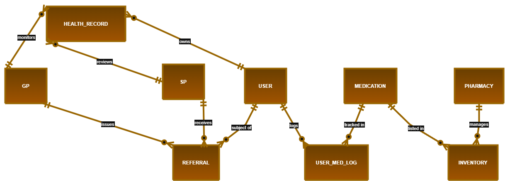

---
# HRec - Conceptual ER Diagram

This diagram represents the core entities and their relationships within the Unified Health Record system.

| Table | Attributes |
| :--- | :--- |
| **Users** | **UserID**, Username, Email, DOB |
| **Health_Records** | **RecordID**, *UserID (Unique)*, BloodType, ChronicConditions, Allergies |
| **GP_Doctors** | **DoctorID**, Name, LicenseNumber |
| **SP_Specialists** | **SpecID**, Name, Specialization |
| **Referrals** | **ReferralID**, *UserID*, *IssuingDoctorID*, *ReceivingSpecID*, DateIssued, Reason |
| **Pharmacies** | **PharmaID**, StoreName, Location |
| **Medications** | **MedID**, MedName, BasePrice |
| **Inventory** | **InventoryID**, *PharmaID*, *MedID*, StockQuantity, RetailPrice |
| **User_Med_Logs** | **LogID**, *UserID*, *MedID*, Dosage, LogDate |

---

---

## 📖 ER Diagram Legend (Crow's Foot Notation)

| Symbol / Element | Meaning | Example in HRec Project |
| :--- | :--- | :--- |
| **Rectangle Box** | **Entity:** A distinct real-world object or concept. | `USER`, `PHARMACY`, `MEDICATION` |
| `||` (Two Vertical Lines) | **Exactly One (Mandatory):** Must exist and there can only be one. | A Health Record belongs to *exactly one* `USER`. |
| `o{` (Circle & Crow's Foot)| **Zero or Many (Optional):** Can have none, or multiple. | A `GP` can issue *zero or many* Referrals. |
| `|{` (Line & Crow's Foot) | **One or Many (Mandatory):** Must have at least one, can have more. | (Often used for items that must exist in inventory). |
| `o|` (Circle & Line) | **Zero or One (Optional):** Might exist, but no more than one. | (Often used for optional profile details). |
| **Text on Line** | **Relationship Role:** Describes how the two boxes interact. | A `GP` "monitors" a `HEALTH_RECORD`. |